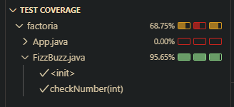

# FizzBuzz Kata in Java

## Requirements

- JDK 21  
- Maven  
- JUnit 5  
- Hamcrest  

---

## Task Description

The program prints numbers from 1 to 100 with the following rules:

- Returns `Fizz` if the number is divisible by 3 or contains the digit 3.  
- Returns `Buzz` if the number is divisible by 5 or contains the digit 5.  
- Returns `FizzBuzz` if the number is divisible by both 3 and 5.  
- Otherwise, returns the number itself.

---

## UML Class Diagram

---

## Test Results Screenshot

